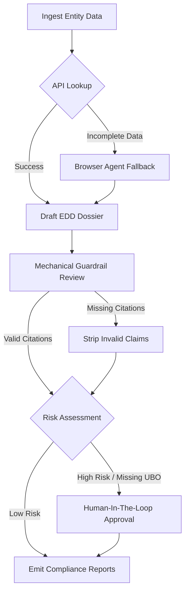
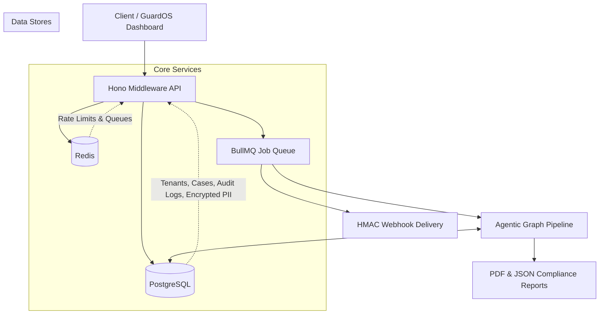

# KYC Copilot 🛡️

> **The 14-Minute Agentic AML/KYC Compliance Platform.**

KYC-Copilot is an agentic AML/KYC compliance platform built for EU payments institutions. It replaces manual corporate onboarding dossiers with an evidence-backed pipeline.

### 📈 Impact at a Glance
| Metric | Value |
|--------|-------|
| 📉 **Time Savings** | 95% Reduction in manual KYC onboarding time. |
| ⚖️ **Compliance** | 100% Alignment with AMLD6 EU directives. |
| 🤖 **Accuracy** | Zero Hallucinations via mechanical citation guardrails. |
| ⚡ **Deployment** | <5 Seconds to spin up a local presentation demo. |

---

## ⚙️ Tech Stack

| Layer | Tool | Notes |
|---|---|---|
| Runtime | Node.js 20+, TypeScript 5.7 | `strict` + `exactOptionalPropertyTypes` + `noUncheckedIndexedAccess`; **Typecheck-Zero** on `npm run typecheck` |
| API | Hono 4.6 | Async-first, RFC 7807 problem responses |
| ORM | Drizzle 0.38 | Type-safe Postgres access, no codegen runtime |
| Database | PostgreSQL 16 | Encrypted PII, evidence ledger, audit chain |
| Queue | BullMQ 5 on Redis 7 | `kyc-graph` worker, 3-attempt exponential backoff |
| Browser | **Playwright 1.49 (Unified Dual-Semaphore Pool)** for both Browser Fallback and PDF Rendering (ADR-012) | Single Chromium process partitioned into two independent semaphores (8 browser + 2 PDF) |
| PDF | Playwright `page.pdf()` + Redis content-hash cache | 5-min TTL, ~80% dashboard hit rate; `pdf:{caseId}:{sha256(semantic)}` |
| Validation | Zod 3.24 | Every LLM output and HTTP body passes through Zod (ADR-007) |
| LLM | `@langchain/core` 0.3 (provider-agnostic) | Tier routing layer ships in Phase 2 |
| Logging | Pino 9 | `AsyncLocalStorage`-bound request context, PII redaction in log lines |
| Infra | MinIO (S3), Stripe, Resend | Self-hostable; no external PII egress |

> **Puppeteer removed (Phase 3, 2026-06-17).** A single Playwright Chromium now serves both scraping and PDF generation, partitioned by two independent semaphores (8 + 2) so a flood of dashboard refreshes cannot starve the dossier pipeline. PDF results are content-hash-cached in Redis with a 5-minute TTL.

---

## 🧩 The Core Pipeline

The pipeline ingests entity data, performs registry and screening lookups, drafts an AMLD6-aligned enhanced due diligence dossier, enforces mechanical citation guardrails, pauses for human approval when required, and emits immutable JSON/PDF compliance reports.



---

## 🏛 System Architecture

The technical foundation leverages a scalable, async-first architecture, written in **Typecheck-Zero** strict TypeScript (`strict` + `exactOptionalPropertyTypes` + `noUncheckedIndexedAccess`). Every commit must pass `npm run typecheck` clean before merge.



---

## 🚀 The 1-Click "Wow" Demo

Experience the platform immediately. 

```bash
# Start the cinematic GuardOS dashboard, fully seeded with demo data
npm install
npm run demo
```
Navigate to `http://localhost:3000` to see the live demo environment.

---

## 🗺 Roadmap

### Shipped (v1.0.0 + Phase 0.5 + Phase 3)
- [x] AMLD6-aligned EDD dossier pipeline (14-min end-to-end)
- [x] Zod-everywhere structured output (ADR-007)
- [x] Evidence hash chain in PostgreSQL (ADR-005)
- [x] Playwright Unified Dual-Semaphore Pool — browser fallback + PDF rendering on a single Chromium (ADR-012)
- [x] Redis-cached PDF reports (5-min TTL, content-hash keyed)
- [x] `PoolTimeoutError` with `requiresHuman: true` escalation (INV-007 strict)
- [x] Typecheck-Zero strict TypeScript (`npm run typecheck` exits 0)

### In progress
- [ ] **Phase 2 — Dynamic Multi-Provider LLM Routing** (Gemini 1.5 Flash, GPT-4o-mini, Ollama 8B) via `DynamicLlmRouter` — see `docs/PLAN_cost_optimization.md`
- [ ] Coverage gate at 70% (currently 22.7%; 8 new vitest cases shipped, more needed)

### Backlog (ADR-001 / §15 Open Gaps)
- [ ] Migrate imperative `KycGraph` to compiled LangGraph `StateGraph`
- [ ] Stripe billing enforcement in production
- [ ] SAML/SSO
- [ ] Scheduled re-screening cron
- [ ] `GET /tenants/:id/usage` returns empty array (stub)

---

## 🛠 Developer Deep-Dive & Source Layout

### Directory Layout
- 📂 `src/config/` — Environment validation and Pino logging
- 📂 `src/db/` — Drizzle schema, database pool, migration, seed
- 🧠 `src/graph/` — Typed agent state, lifecycle nodes, graph runner
- 🔌 `src/services/kyc-data/` — OpenCorporates and ComplyAdvantage clients
- 🌐 `src/services/browser/` — Playwright fallback, proxy rotation, registry map
- 🤖 `src/services/llm/` — Deterministic structured dossier drafting and fallback hooks
- 💳 `src/services/billing/` — Stripe adapter and usage metering
- 📄 `src/services/reports/` — JSON report generation and PDF rendering
- 🪝 `src/services/webhooks/` — HMAC dispatcher and delivery worker
- 🔒 `src/services/audit/` — Immutable audit log writer
- 🔐 `src/services/encryption/` — AES-256-GCM PII encryption
- 🛣 `src/api/` — Hono middleware, routes, app assembly
- ⚙️ `src/workers/` — BullMQ graph and webhook workers
- 🎨 `public/` — Landing page and GuardOS dashboard
- 🧪 `tests/` — Unit, integration, e2e, and fixtures

### <details><summary><b>🔌 API Surface (Click to Expand)</b></summary>
**Public routes:**
- `GET /health` — liveness with DB, Redis, and OpenAI checks.
- `GET /ready` — readiness, returns `503` if a dependency is unavailable.
- `GET /` — landing page.
- `GET /app` — dashboard shell.
- `POST /provision` — creates a tenant, admin user, and one API key. The raw API key is returned once.
- `POST /auth/login` — returns 15-minute JWT access token and 7-day refresh token.
- `POST /auth/refresh` — rotates refresh token.

**Authenticated routes:**
- `POST /cases` — creates a KYC case and queues graph execution.
- `GET /cases` — lists masked tenant cases.
- `GET /cases/stream` — server-sent snapshot for dashboard updates.
- `GET /cases/export` — GDPR portability export.
- `GET /cases/:id` — case detail, graph state, evidence, and audit trail.
- `POST /cases/:id/approve` — completes HITL review.
- `POST /cases/:id/rescreen` — triggers a new run for Growth and Enterprise tenants.
- `GET /cases/:id/report?format=json|pdf` — downloads compliance report.
- `DELETE /cases/:id/erase` — GDPR hard delete.
- `GET /dashboard` — aggregate metrics and recent cases.
- `GET /usage` — monthly usage and ROI metrics.
- `POST /webhooks` — registers a tenant webhook endpoint.
- `GET /webhooks` — lists webhook endpoints without secrets.
- `POST /webhooks/:id/test` — queues a signed test event.

**Admin routes:**
- `GET /tenants`
- `GET /tenants/:id/usage`
- `POST /tenants/:id/plan`
</details>

### <details><summary><b>🛡 Security Controls (Click to Expand)</b></summary>
- API keys are bcrypt-hashed and never stored in plaintext.
- JWT access tokens expire after 15 minutes; refresh tokens expire after 7 days and rotate on use.
- `registrationNumber`, company names, webhook secrets, and evidence source URLs are encrypted at rest with AES-256-GCM.
- Pino structured logging masks PII and redacts secrets.
- Redis-backed rate limits enforce tenant API limits and stricter auth IP limits.
- Secure headers include `X-Frame-Options`, HSTS, and CSP.
- Inputs are normalized with Unicode NFKC and HTML/script injection patterns are stripped.
- External clients use retries, timeouts, and circuit breakers.
- Failed cases are persisted in `failed_cases` for manual review.
</details>

### <details><summary><b>⚖️ Compliance Model (Click to Expand)</b></summary>
Reports cite AMLD6 article records stored in PostgreSQL with effective dates. Every claim in the dossier must cite a key in the evidence ledger. The guardrail node mechanically removes claims without valid evidence. Audit logs are append-only and hash each event payload for chain-of-custody review.
</details>

---

## License

MIT. See `LICENSE` if present in the repository root.
