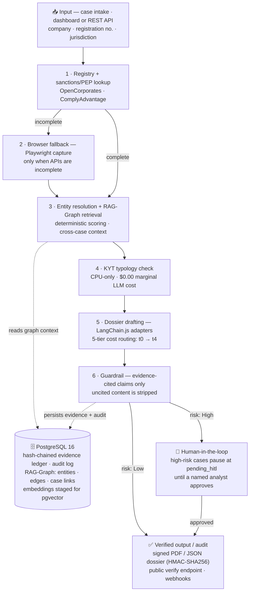
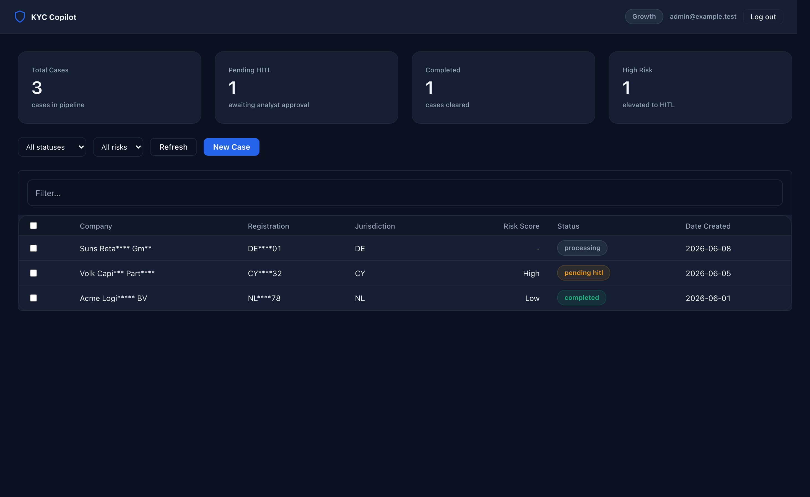
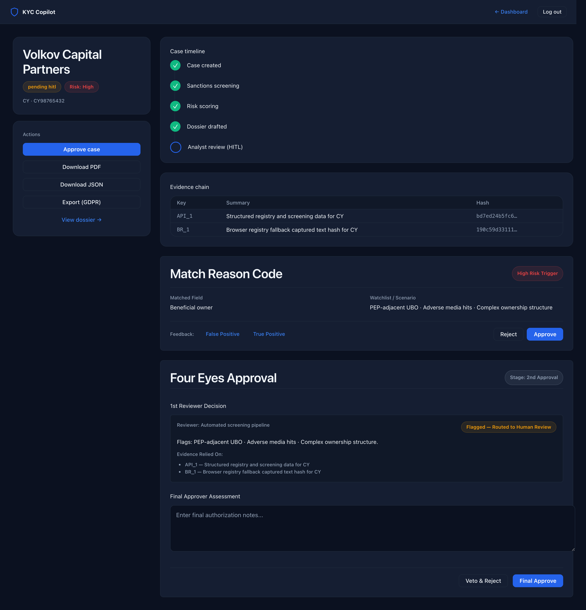
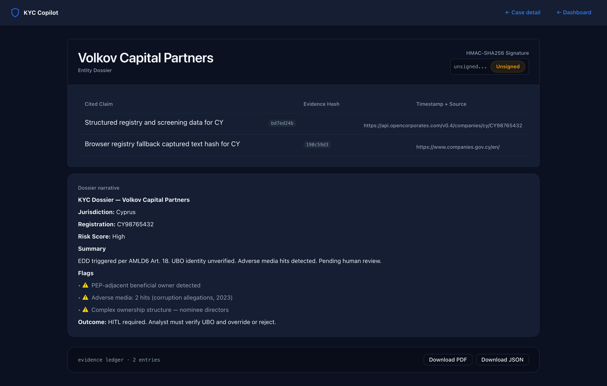
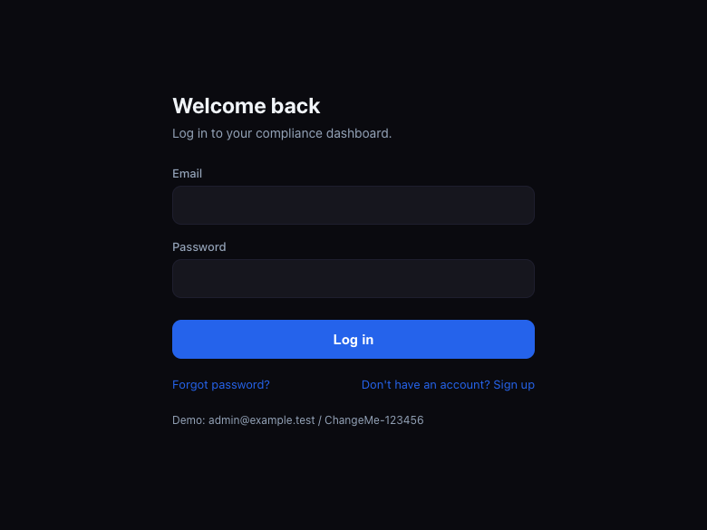
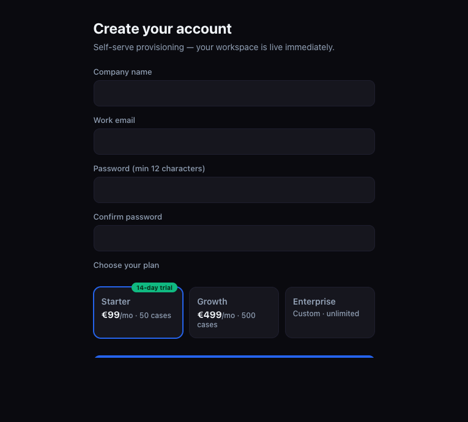
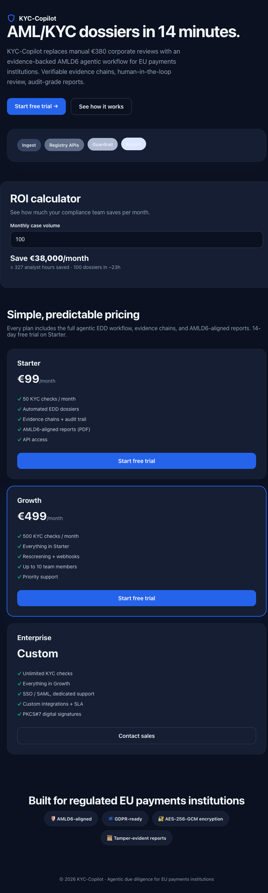
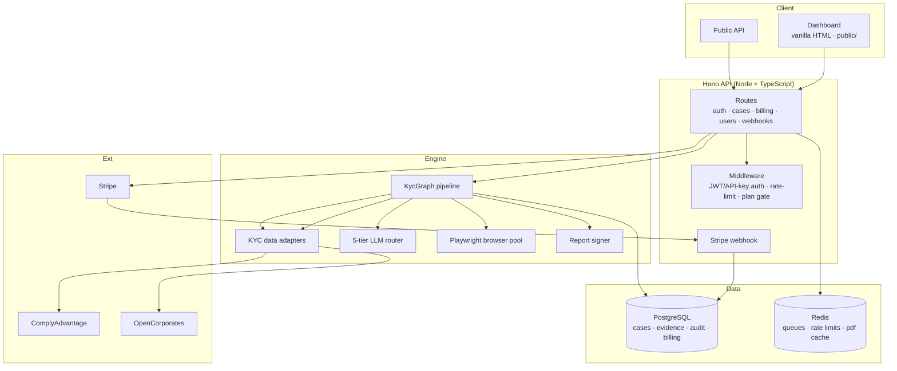

<!-- KYC Copilot — README (customer-facing) -->
<div align="center">

# 🔐 KYC Copilot

**Agentic AML/KYC due diligence for EU payments institutions.**

Turn a ~3.5 hour manual corporate review into an evidence-backed, audit-grade
dossier in **14 minutes**.


[Business impact](#-business-impact) · [Architecture](#-architecture-at-a-glance) · [Tech stack](#-tech-stack) · [Product tour](#-product-tour) · [Features](#-features) · [Security](#-security--compliance) · [Quickstart](#-quickstart) · [Docs](#-documentation)

</div>

---

## 📈 Business Impact

> **Automated a previously manual, error-prone KYC compliance review process.
> Reduced manual document verification time by 60% while generating structured,
> auditable trails for regulatory accuracy.**

- **~3.5 h → ~14 min per corporate EDD review** — registry screening, sanctions
  & PEP checks, UBO extraction, dossier drafting and report generation collapse
  into a single automated pass.
- **~€380 of analyst time avoided per case** — surfaced live on the dashboard
  ROI card.
- **~92% lower LLM cost per dossier** than all-frontier routing — 80% of
  golden-benchmark cases route to the cheapest capable tier (t0–t2; target ≥ 60%).
- **Audit-ready by construction** — every claim in a dossier must cite an entry
  in the hash-chained evidence ledger; uncited claims are mechanically stripped
  by the guardrail before the dossier is stored. Reports carry an HMAC-SHA256
  integrity signature and a public verification endpoint.
- **Measured, not asserted** — evaluation-harness gates: entity-resolution F1
  **1.000** (gate > 0.90) · KYT typology Macro-F1 **1.000** (gate > 0.85) ·
  tier agreement **1.000** · drift tripwire green →
  [`tests/evaluation/BASELINES.md`](tests/evaluation/BASELINES.md).

---

## 🏗 Architecture at a Glance

From raw entity input to a verified, evidence-cited dossier — deterministic
wherever possible, schema-validated at every LLM boundary:


```mermaid
flowchart TB
    A["📥 Input — case intake · dashboard or REST API<br/>company · registration no. · jurisdiction"]
    B1["1 · Registry + sanctions/PEP lookup<br/>OpenCorporates · ComplyAdvantage"]
    B2["2 · Browser fallback — Playwright capture<br/>only when APIs are incomplete"]
    B3["3 · Entity resolution + RAG-Graph retrieval<br/>deterministic scoring · cross-case context"]
    B4["4 · KYT typology check<br/>CPU-only · $0.00 marginal LLM cost"]
    B5["5 · Dossier drafting — LangChain.js adapters<br/>5-tier cost routing: t0 → t4"]
    B6["6 · Guardrail — evidence-cited claims only<br/>uncited content is stripped"]
    C[("🗄️ PostgreSQL 16<br/>hash-chained evidence ledger · audit log<br/>RAG-Graph: entities · edges · case links<br/>embeddings staged for pgvector")]
    D["✅ Verified output / audit<br/>signed PDF / JSON dossier (HMAC-SHA256)<br/>public verify endpoint · webhooks"]
    E["👤 Human-in-the-loop<br/>high-risk cases pause at pending_hitl<br/>until a named analyst approves"]

    A --> B1
    B1 -->|"incomplete"| B2 --> B3
    B1 -->|"complete"| B3 --> B4 --> B5 --> B6
    B3 -.->|"reads graph context"| C
    B6 -.->|"persists evidence + audit"| C
    B6 -->|"risk: Low"| D
    B6 -->|"risk: High"| E -->|"approved"| D
```

| Stage | What happens |
|---|---|
| 📥 **Input** | Case intake from the dashboard or REST API — `companyName`, `registrationNumber`, ISO-2 `jurisdiction`. No documents to upload; the system fetches its own evidence. |
| 🧠 **RAG-Graph agent** | The imperative `KycGraph` pipeline (ADR-001): registry + sanctions/PEP lookup, Playwright browser fallback when APIs are incomplete, deterministic entity resolution seeding cross-case graph context into the dossier prompt, offline KYT typology check, dossier drafting across 5 model tiers, then the guardrail. |
| 🗄️ **PostgreSQL 16** | Hash-chained evidence ledger, RAG-Graph tables (`graph_entities` / `graph_edges` / `case_entities`), audit log, cases and billing. The `embedding` column is staged for pgvector — the vector-search upgrade path adds no new infrastructure. |
| ✅ **Verified output / audit** | AMLD6-aligned dossier → signed PDF/JSON report (HMAC-SHA256 integrity signature + public verify endpoint). High-risk cases pause at `pending_hitl` until a named analyst approves — there is no automated path around it. Every action lands in the immutable audit trail. |

> Deep-dive: [docs/ARCHITECTURE_CONTEXT.md](docs/ARCHITECTURE_CONTEXT.md) · full topology diagram [below](#-system-topology).

---

## 🛠 Tech Stack

| Layer | Keywords |
|---|---|
| **Language & runtime** | `TypeScript 5.7` (strict, ESM) · `Node.js 20+` |
| **AI & RAG** | `LangChain.js` adapters (OpenAI · Anthropic · Gemini · Ollama) · `RAG`-Graph cross-case retrieval · 5-tier cost routing (t0 deterministic → t4 frontier) · deterministic CPU classifiers (entity resolution · difficulty routing · KYT typology) · Redis graph-aware response cache · `Structured Prompt Engineering` (Zod-validated JSON, XML-tagged anti-injection envelopes, PII-redacted prompts) |
| **Data** | `PostgreSQL 16` · Drizzle ORM · `Redis 7` · BullMQ · `pgvector`-ready embedding column (JSONB today; extension staged for the vector-search upgrade) |
| **API & integrations** | Hono · OpenCorporates · ComplyAdvantage · `Stripe` (Checkout · Portal · metered usage) · Resend · HMAC-signed webhooks with DLQ + replay |
| **Security** | AES-256-GCM PII at rest · SHA-256 evidence hash chain · HMAC-SHA256 report signing · JWT + O(1) timing-safe API keys |
| **Infra & DX** | `Docker` / Compose (app · PostgreSQL · Redis) · Fly.io · Cloudflare WAF (Terraform) · Vitest + Testcontainers + MSW · Pino · evaluation harness with drift tripwire |

---

## What is KYC Copilot?

KYC Copilot is a self-serve, agentic due-diligence platform for EU payments
institutions, PSPs and fintech compliance teams. It automates the end-to-end
**Enhanced Due Diligence (EDD)** workflow — entity intake, registry screening,
sanctions & PEP checks, UBO extraction, dossier drafting, human-in-the-loop
review, and audit-grade reporting — with **every claim cited to an immutable
evidence chain**.

No more copy-pasting between registries, spreadsheets and emails. No more
unverifiable LLM output. No more €380-per-case analyst hours.

```text
Manual EDD                          KYC Copilot
────────────────────                ─────────────────────────────
~3.5 h per case                     ~14 min per case
Copy-paste from registries          Automated registry + browser capture
Unverifiable write-ups              Every claim cites an evidence hash
High-risk review ad-hoc             Built-in human-in-the-loop workflow
PDFs with no integrity              Tamper-evident signed reports
```

---

## 📸 Product Tour

### Dashboard — compliance overview at a glance

Real-time metrics, a searchable case table with status/risk filters, and
one-click **New Case**. Click any row to open the full case workspace.

<p align="center">
  
</p>

### Case review — timeline, match reasons, four-eyes approval

High-risk cases route to a dedicated review workspace: the processing timeline,
the hashed evidence chain, the match-reason panel, and a four-eyes approval
gate. Only a named analyst can approve — there is no automated path around
`pending_hitl`.

<p align="center">
  
</p>

### Dossier — audit-ready, every claim cited

Each dossier claim links to an entry in the immutable, hash-chained evidence
ledger; uncited claims are struck through. Reports carry an HMAC-SHA256
signature with content-integrity verification (the zero-key demo runs unsigned
and shows that state honestly), downloadable as PDF or JSON.

<p align="center">
  
</p>

### Self-serve onboarding

Sign up in minutes, pick a plan, and complete a 14-day trial on Stripe Checkout.
No sales call required.

<p align="center">
  
  
</p>

### Landing page

Pricing, a live ROI calculator, and compliance positioning for prospects.

<p align="center">
  
</p>

---

## ✨ Features

### Core engine

| Feature | What you get |
|---|---|
| **Agentic EDD pipeline** | Ingest → registry API lookup → browser fallback → dossier drafting → guardrail → report. Fully automated. |
| **Evidence-cited dossiers** | Every claim must cite an entry in the immutable, hash-chained evidence ledger — enforced mechanically, not by prompt. |
| **UBO extraction** | Beneficial-ownership data pulled from registry officers with graceful degradation when sources are incomplete. |
| **Human-in-the-loop (HITL)** | High-risk cases lock at `pending_hitl` until a named analyst approves — there is no automated path around it. |
| **5-tier LLM routing** | Deterministic tier for cost/speed, frontier models for complex dossiers, automatic fallback when providers are down. |
| **Zero-key demo mode** | Fully deterministic local operation with no API keys — run the whole product offline. |

### Compliance & reports

| Feature | What you get |
|---|---|
| **AMLD6-aligned reports** | PDF and JSON dossiers citing AMLD6 articles (Art. 13 CDD, Art. 18 EDD). |
| **Content-integrity signatures** | Every report carries an HMAC-SHA256 signature over its canonical content — tamper-evident and independently verifiable via `POST /cases/:id/report/verify`. |
| **Full audit trail** | Every action (create, complete, approve, erase) is hash-linked and retained. |
| **GDPR-first** | Encrypted PII at rest (AES-256-GCM), masked displays, full data export, and one-click erasure. |

### Product & business

| Feature | What you get |
|---|---|
| **Self-serve signup** | Company + email + password → Stripe Checkout → live workspace. 14-day trial on Starter. |
| **Stripe subscription billing** | Starter (€99/mo · 50 cases), Growth (€499/mo · 500 cases), Enterprise (custom). Customer Portal for self-service plan changes. |
| **Usage metering & quotas** | Real per-month usage metering; `402 Payment Required` with an upgrade link when your plan limit is hit. |
| **Search & filtering** | Case search by company, status/risk filters, sortable columns, pagination. |
| **Team management** | Invite members, admin/analyst roles, last-active tracking. |
| **API access** | REST API with `kc_live_*` keys for machine-to-machine integration (O(1) timing-safe auth). |
| **Webhooks** | `case.created` / `case.completed` / `case.pending_hitl` / `case.approved` / `case.failed` events with HMAC signing, retries and dead-letter queue. |
| **ROI tracking** | Dashboard shows cost avoided (€380/case) and analyst hours saved. |

---

## 🔄 How it works

Walking through the stages of the [architecture diagram](#-architecture-at-a-glance) above:

1. **Intake** — A compliance officer creates a case (company name, registration
   number, jurisdiction) from the dashboard or the API.
2. **Registry lookup** — The system queries company registries and screening
   providers for corporate data, sanctions and PEP matches, and UBOs.
3. **Browser fallback** — When APIs are incomplete, a managed Chromium pool
   captures the public registry directly.
4. **Drafting** — An LLM (routed across 5 tiers by cost/quality) drafts the
   dossier. The **guardrail** strips anything not backed by the evidence ledger.
5. **Decision** — Low-risk cases complete automatically. High-risk cases lock
   at `pending_hitl` until a named analyst approves.
6. **Report** — A signed, AMLD6-aligned PDF/JSON report is generated with a
   verifiable content-integrity signature.

---

## 🏗 System Topology


```mermaid
flowchart TB
    subgraph Client
        U[Dashboard<br/>vanilla HTML · public/]
        A[Public API]
    end
    subgraph API["Hono API (Node + TypeScript)"]
        R[Routes<br/>auth · cases · billing · users · webhooks]
        M[Middleware<br/>JWT/API-key auth · rate-limit · plan gate]
        W[Stripe webhook]
    end
    subgraph Engine
        G[KycGraph pipeline]
        AD[KYC data adapters]
        LLM[5-tier LLM router]
        BR[Playwright browser pool]
        S[Report signer]
    end
    subgraph Data
        PG[(PostgreSQL<br/>cases · evidence · audit · billing)]
        RD[(Redis<br/>queues · rate limits · pdf cache)]
    end
    subgraph Ext
        ST[Stripe]
        CA[ComplyAdvantage]
        OC[OpenCorporates]
    end
    U --> R
    A --> R
    R --> M
    W --> PG
    R --> G
    G --> AD --> OC
    G --> AD --> CA
    G --> LLM
    G --> BR
    G --> S
    R --> RD
    G --> PG
    R --> ST
    ST --> W
```

| Layer | Technology |
|---|---|
| Runtime | Node.js 20+, TypeScript 5.7 (strict), ESM |
| API | Hono — typed routes, middleware, RFC-7807 problem responses |
| Database | PostgreSQL 16 + Drizzle ORM (migrations, type-safe queries) |
| Cache / queues | Redis 7 — BullMQ graph jobs, atomic Lua rate limiting, PDF cache |
| Browser | Playwright shared pool with dual-semaphore concurrency control |
| LLM | `t0` deterministic → `t4` frontier, automatic fallback |
| Billing | Stripe Checkout, Customer Portal, metered usage records |
| Encryption | AES-256-GCM at rest, SHA-256 evidence hash chain, HMAC report signing |
| Deployment | Docker, Fly.io (`fly.toml`), Terraform WAF (`infra/`) |

> Deep-dive: [docs/ARCHITECTURE_CONTEXT.md](docs/ARCHITECTURE_CONTEXT.md)

---

## 🛡 Security & Compliance

- **PII at rest** — company names, registration numbers, and source URLs are
  encrypted with AES-256-GCM; the UI only ever renders masked values.
- **Constant-time auth** — API keys resolve via an HMAC shadow index (O(1)
  index hit + `crypto.timingSafeEqual`), no bcrypt scans, no timing leaks.
- **JWT sessions** — 15-minute access + 7-day refresh tokens for dashboard
  users; refresh-token rotation with revocation on password reset.
- **Atomic rate limiting** — single-round-trip Redis Lua token buckets.
- **Webhook integrity** — outgoing webhooks are HMAC-signed; incoming Stripe
  events verify the `Stripe-Signature` header and are idempotently logged.
- **Tamper-evident reports** — HMAC-SHA256 content signatures + a public
  verification endpoint.
- **Hardened headers** — `X-Frame-Options`, `Strict-Transport-Security`, and a
  restrictive Content-Security-Policy on every response.
- **Audit logging** — every state-changing action is hash-chained into the
  audit ledger.

See [SECURITY.md](SECURITY.md) for the full production-hardening checklist and
secret-handling policy.

---

## 🚀 Quickstart

### 1. One-command demo (Docker)

```bash
npm run demo        # docker compose up postgres redis → migrate → seed → dev
```

Then open <http://localhost:3000> and log in with:

```
Email:    admin@example.test
Password: ChangeMe-123456
```

### 2. Run without Docker (local Postgres + Redis)

```bash
npm install
npm run db:migrate && npm run db:seed
LLM_TIER_PRIMARY=t0 npm run dev
```

### 3. Try the zero-key flow

```bash
# Low-risk entity → auto-completes
curl -X POST 'http://localhost:3000/cases?sync=true' \
  -H "Authorization: Bearer <api-key-or-jwt>" \
  -H "Content-Type: application/json" \
  -d '{"companyName":"Acme Logistics BV","registrationNumber":"NL12345678","jurisdiction":"NL"}'

# High-risk entity → pauses for human review
curl -X POST 'http://localhost:3000/cases?sync=true' \
  -H "Authorization: Bearer <api-key-or-jwt>" \
  -H "Content-Type: application/json" \
  -d '{"companyName":"Volkov Capital Partners","registrationNumber":"CY98765432","jurisdiction":"CY"}'
```

### 4. Verification

```bash
npm run typecheck   # strict TS
npm run test        # full suite — unit, integration, contract, real E2E lifecycle
npm run build       # production build → dist/
docker build .      # container image
docker compose run --rm test   # full suite against real Postgres + Redis
```

---

## 🗺 Repository layout

```text
src/
  api/          # Hono app: middleware, routes (auth, cases, billing, users, webhooks)
  db/           # Drizzle schema, migrations, seed
  graph/        # KycGraph pipeline + nodes
  services/     # kyc-data, llm, reports, billing, encryption, audit, webhooks, browser
  workers/      # BullMQ graph-runner + webhook-deliverer
  utils/        # id, mask, date, retry
public/         # Vanilla HTML product: landing, login, signup, dashboard, resets
design-system/  # Canonical tokens, CSS, registry, Lit runtime (gates: token-lint · contrast · registry-check · ds-vr; CI-enforced)
docs/           # Architecture, decisions (ADRs), shipping status, screenshots
infra/          # Fly secrets, Cloudflare WAF (Terraform)
tests/          # Unit, integration, contract, and real E2E lifecycle tests
```

---

## 📚 Documentation

| Doc | What it covers |
|---|---|
| [docs/ARCHITECTURE_CONTEXT.md](docs/ARCHITECTURE_CONTEXT.md) | System topology, request lifecycle, data model, invariants |
| [docs/DECISIONS.md](docs/DECISIONS.md) | Architecture Decision Records (ADR-001 → ADR-025) |
| [docs/SHIPPING_STATUS.md](docs/SHIPPING_STATUS.md) | Ready vs stub inventory, capability matrix |
| [docs/OPERATIONS.md](docs/OPERATIONS.md) | Running, deploying, and operating in production |
| [SECURITY.md](SECURITY.md) | Security posture, secret handling, hardening checklist |
| [tests/evaluation/BASELINES.md](tests/evaluation/BASELINES.md) | Golden-dataset gates — entity-resolution F1, tier routing, KYT typology, drift tripwire |
| [docs/PLAN_BUSINESS_MVP_IMPLEMENTATION.md](docs/PLAN_BUSINESS_MVP_IMPLEMENTATION.md) | The Business MVP implementation plan (Phases A–G) |

---

<div align="center">

Built for regulated EU payments institutions. © 2026 KYC Copilot · [MIT License](./LICENSE)

</div>
