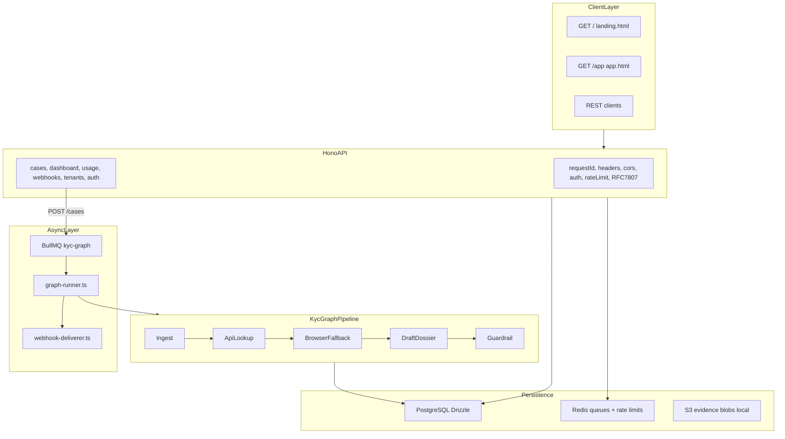

# ARCHITECTURE_CONTEXT — KYC Copilot

> TL;DR: Agentic AML/KYC platform. Hono API → BullMQ worker → imperative KycGraph pipeline → Postgres with encrypted PII. HITL via API approve endpoint.

## §1 Executive Snapshot

| Field | Value |
|---|---|
| Product | Agentic AML/KYC compliance copilot for EU payments institutions |
| Value prop | 14-min evidence-backed dossier vs 3.5h manual / €380 per case |
| Repo | `github.com/kakashi3lite/kyc-copilot` |
| Version | 1.0.0 |
| Runtime | Node 20+, `docker compose up --build` |
| Brand tagline | "Compliance at the speed of intelligence" |

## §2 Product Contract

> TL;DR: One entity in → evidence-backed AMLD6 dossier + report out. Every claim cited.

| Input | `companyName`, `registrationNumber`, `jurisdiction` (ISO-2) |
|---|---|
| Output | EDD dossier, JSON/PDF report, evidence chain, audit trail |
| Citation format | `[Source: KEY]` mapped to `evidence` table row |
| HITL triggers | High risk, sanctions match, unverified UBO, browser failure, partial API data |
| Plans | `starter` (50 cases), `growth` (500), `enterprise` (unlimited) |

Install commands: see [README.md](../README.md).

## §3 System Topology



Bootstrap: `src/index.ts:L8-L12` — creates Hono app, starts graph worker, serves on `env.PORT`.

## §4 Request Lifecycle — Case Creation

> TL;DR: POST /cases → encrypt PII → queue or sync run → graph → persist evidence → webhook.

| Step | Location | Action |
|---|---|---|
| 1 | `src/api/routes/cases.ts:L23-L31` | Validate body (Zod), insert case with encrypted PII + masks |
| 2 | `src/api/routes/cases.ts:L28` | Audit log `case.created` |
| 3 | `src/api/routes/cases.ts:L29` | `?sync=true` → `runCase()` inline; else `graphQueue.add()` |
| 4 | `src/workers/graph-runner.ts:L27-L40` | Worker sets `processing`, runs `KycGraph.run()` |
| 5 | `src/workers/graph-runner.ts:L34-L36` | Insert evidence rows; update case status/risk/dossier/graphState |
| 6 | `src/workers/graph-runner.ts:L38-L40` | Audit log, usage increment, webhook enqueue |
| 7 | `src/workers/graph-runner.ts:L41-L47` | On failure: `failed` status + `failed_cases` row + webhook |

HITL approval (external to graph): `src/api/routes/cases.ts:L94-L105` — `POST /cases/:id/approve`.

Human review node exists (`src/graph/nodes/human-review.ts`) but is called from approve flow logic, not from `KycGraph.run()`.

## §5 Graph Pipeline

> TL;DR: Imperative `KycGraph` class — NOT compiled LangGraph StateGraph. Guardrail sets final status.

### Orchestrator

`src/graph/graph.ts:L16-L34` — `KycGraph.run()`:

| Order | Node | Timeout | Pointer |
|---|---|---|---|
| 1 | `ingestNode` | 5s | `src/graph/nodes/ingest.ts` |
| 2 | `apiLookupNode` | 30s | `src/graph/nodes/api-lookup.ts` |
| 3 | `browserFallbackNode` (conditional) | 60s | `src/graph/edges.ts:L5-L7`, `src/graph/nodes/browser-fallback.ts` |
| 4 | `draftDossierNode` | 30s | `src/graph/nodes/draft-dossier.ts` |
| 5 | `guardrailNode` | 30s | `src/graph/nodes/guardrail.ts` |

### Routing

| Function | Condition | Next |
|---|---|---|
| `afterApiLookup()` | `completeness === "complete" && uboVerified` | skip browser |
| `afterApiLookup()` | else | `browserFallbackNode` |
| `guardrailNode()` | `requiresHuman \|\| highRisk \|\| !uboVerified \|\| browserFailed` | `status: pending_hitl` |
| `guardrailNode()` | else | `status: completed` |

### State shape

`src/graph/state.ts:L3-L18` — `AgentState`:

- Identity: `caseId`, `tenantId`, `companyName`, `registrationNumber`, `jurisdiction`
- Data: `apiData`, `browserResult`, `evidenceLedger`, `claims`, `dossier`
- Outcome: `riskScore`, `requiresHuman`, `uboVerified`, `browserFailed`, `guardrailFindings`, `status`
- Audit: `auditTrail[]`

Zod schemas: `src/graph/schemas.ts` — `EntityInputSchema`, `ApiCompanyDataSchema`, `DossierSchema`.

`PostgresSaver` exported at `src/graph/graph.ts:L36-L38` but checkpointing uses `cases.graphState` JSONB today.

### Dependencies injected into graph

`src/workers/graph-runner.ts:L23-L25`:
- `CompositeKycDataAdapter` (OpenCorporates + ComplyAdvantage)
- `PlaywrightBrowserPool`
- `FallbackLlmClient`

## §6 Data Model

> TL;DR: 10 Postgres tables. PII in `*Encrypted` columns; lists use `*Mask` only.

| Table | Purpose | Key columns |
|---|---|---|
| `tenants` | Multi-tenant orgs | `plan`, `apiKeyHash`, `webhookSecretEncrypted`, `stripeCustomerId` |
| `users` | Dashboard users | `email`, `passwordHash`, `refreshTokenHash`, `role` |
| `cases` | KYC case lifecycle | `*Encrypted`, `*Mask`, `status`, `riskScore`, `dossier`, `graphState` |
| `evidence` | Immutable evidence ledger | `key`, `sourceUrlEncrypted`, `contentHash`, `previousHash` |
| `audit_logs` | Append-only audit trail | `actor`, `action`, `hash`, `oldValue`, `newValue` |
| `usage` | Monthly metering | `casesProcessed`, `apiCalls`, `costUsd` |
| `webhooks` | Outbound endpoints | `urlEncrypted`, `secretEncrypted`, `events[]` |
| `webhook_deliveries` | Delivery queue | `status`, `attempts`, `nextAttemptAt` |
| `failed_cases` | Dead-letter for graph failures | `reason`, `payload` |
| `amld6_articles` | Compliance article reference data | `article`, `title`, `effectiveFrom` |

Enums: `plan` (starter/growth/enterprise), `case_status` (queued/processing/pending_hitl/completed/failed/archived), `risk_score` (Low/Medium/High/Pending).

Schema source: `src/db/schema.ts`.

## §7 API Surface

> TL;DR: Public health + auth + static pages. Authenticated cases/dashboard/usage/webhooks. Admin tenants.

### Public (no auth)

| Method | Path | Handler |
|---|---|---|
| GET | `/health` | `src/api/routes/health.ts:L7-L10` |
| GET | `/ready` | `src/api/routes/health.ts:L12-L15` |
| GET | `/` | `src/api/index.ts:L32` → `public/landing.html` |
| GET | `/app` | `src/api/index.ts:L33` → `public/app.html` |
| POST | `/provision` | `src/api/routes/auth.ts:L22-L30` |
| POST | `/auth/login` | `src/api/routes/auth.ts:L32-L41` |
| POST | `/auth/refresh` | `src/api/routes/auth.ts:L43-L58` |

### Authenticated (Bearer `kc_live_*` or JWT)

| Method | Path | Notes |
|---|---|---|
| POST | `/cases` | `?sync=true` for inline run |
| GET | `/cases` | Masked PII in list |
| GET | `/cases/stream` | SSE snapshot |
| GET | `/cases/export` | GDPR portability (decrypted) |
| GET | `/cases/:id` | Full detail + evidence + audit |
| POST | `/cases/:id/approve` | HITL completion |
| POST | `/cases/:id/rescreen` | Growth+ only |
| GET | `/cases/:id/report` | `?format=json\|pdf` |
| DELETE | `/cases/:id/erase` | GDPR hard delete |
| GET | `/dashboard` | Metrics + recent cases |
| GET | `/usage` | Monthly ROI summary |
| POST | `/webhooks` | Growth+ only |
| GET | `/webhooks` | Masked URLs |
| POST | `/webhooks/:id/test` | Queue test event |

### Admin (JWT role=admin)

| Method | Path |
|---|---|
| GET | `/tenants` |
| GET | `/tenants/:id/usage` |
| POST | `/tenants/:id/plan` |

### Auth modes

| Mode | Format | Validation |
|---|---|---|
| API key | `Bearer kc_live_*` | bcrypt compare against `tenants.apiKeyHash` — `src/api/middleware/auth.ts:L26-L35` |
| JWT access | `Bearer <jwt>` | 15m expiry, `JWT_SECRET` — `src/api/middleware/auth.ts:L37-L47` |
| JWT refresh | POST body | 7d expiry, rotates on use — `src/api/routes/auth.ts:L43-L58` |

### Plan gates

| Feature | Minimum plan |
|---|---|
| Webhooks | growth |
| Rescreen | growth |

Middleware order: `src/api/index.ts:L21-L29` — onError → requestId → security headers → cors.

## §8 Invariants (INV-xxx)

| ID | Rule | Enforced by |
|---|---|---|
| INV-001 | Every dossier claim has valid `[Source: KEY]` in evidence ledger | `src/graph/nodes/guardrail.ts:L8-L19` |
| INV-002 | Guardrail strips uncited/invalid claims — never bypass | `src/graph/nodes/guardrail.ts` |
| INV-003 | PII encrypted at rest; list endpoints return masks only | `encryptPii`/`decryptPii`, `*Mask` columns |
| INV-004 | Audit logs append-only with hashed payloads | `src/services/audit/logger.ts` |
| INV-005 | API keys bcrypt-hashed; raw key returned once at provision | `src/api/routes/auth.ts:L26-L29` |
| INV-006 | Webhooks signed HMAC-SHA256 via `x-kyc-signature` header | `src/services/webhooks/dispatcher.ts:L9-L11` |
| INV-007 | HITL cases (`pending_hitl`) never auto-approved — require `POST /cases/:id/approve` | `src/graph/nodes/guardrail.ts:L25-L26` |

## §9 File Responsibility Map

| Path | Owns | Key exports |
|---|---|---|
| `src/index.ts` | Process bootstrap, worker, shutdown | — |
| `src/api/index.ts` | Hono app, middleware, static routes | `createApp()` |
| `src/api/middleware/auth.ts` | API key + JWT auth | `authMiddleware`, `getAuth` |
| `src/api/middleware/validate.ts` | Zod request validation | `validateJson` |
| `src/api/middleware/error-handler.ts` | RFC 7807 errors | `problem`, `errorHandler` |
| `src/api/middleware/rate-limit.ts` | Redis rate limits | `rateLimit` |
| `src/api/routes/cases.ts` | Case CRUD lifecycle | `caseRoutes` |
| `src/api/routes/auth.ts` | Provision, login, refresh | `authRoutes` |
| `src/api/routes/health.ts` | Liveness/readiness | `healthRoutes` |
| `src/api/routes/dashboard.ts` | Dashboard metrics | `dashboardRoutes` |
| `src/api/routes/usage.ts` | Usage/ROI | `usageRoutes` |
| `src/api/routes/webhooks.ts` | Webhook registration | `webhookRoutes` |
| `src/api/routes/tenants.ts` | Admin tenant mgmt | `tenantRoutes` |
| `src/graph/graph.ts` | Pipeline orchestration | `KycGraph` |
| `src/graph/edges.ts` | Routing decisions | `afterApiLookup` |
| `src/graph/state.ts` | Agent state types | `AgentState`, `mergeState` |
| `src/graph/schemas.ts` | Zod schemas | `EntityInputSchema`, `DossierSchema` |
| `src/graph/nodes/*.ts` | Pipeline steps | per-node functions |
| `src/workers/graph-runner.ts` | BullMQ graph execution | `runCase`, `graphQueue` |
| `src/workers/webhook-deliverer.ts` | Webhook delivery worker | — |
| `src/db/schema.ts` | Drizzle schema | table definitions |
| `src/db/index.ts` | Pool, Redis, health checks | `db`, `redis` |
| `src/services/encryption/at-rest.ts` | AES-256-GCM PII | `encryptPii`, `decryptPii` |
| `src/services/kyc-data/adapter.ts` | Composite API adapter | `CompositeKycDataAdapter` |
| `src/services/kyc-data/opencorporates.ts` | Registry client | `OpenCorporatesClient` |
| `src/services/kyc-data/comply-advantage.ts` | Screening client | `ComplyAdvantageClient` |
| `src/services/browser/pool.ts` | Playwright fallback | `PlaywrightBrowserPool` |
| `src/services/llm/client.ts` | LLM interface | `LlmClient` |
| `src/services/llm/fallback.ts` | Multi-provider LLM | `FallbackLlmClient` |
| `src/services/reports/generator.ts` | JSON compliance reports | `generateReport` |
| `src/services/reports/pdf-renderer.ts` | PDF via shared Playwright Chromium + Redis content-hash cache (5 min TTL) | `renderPdf` |
| `src/services/webhooks/dispatcher.ts` | Webhook queue + HMAC | `enqueueWebhookEvent` |
| `src/services/audit/logger.ts` | Audit log writer | `writeAuditLog` |
| `src/services/billing/usage-meter.ts` | Usage tracking + ROI | `incrementUsage`, `getUsageSummary` |
| `src/services/billing/stripe.ts` | Stripe adapter | — |
| `src/config/env.ts` | envalid env validation | `env` |
| `src/config/logger.ts` | Pino structured logging | `logger` |
| `public/landing.html` | Marketing page (7 sections, ROI calc) | static |
| `public/app.html` | Dashboard (5 UX upgrades) | static |
| `tests/unit/` | Node + encryption unit tests | vitest |
| `tests/integration/` | API + pipeline integration | vitest + testcontainers |
| `tests/e2e/` | Full lifecycle e2e | vitest |

## §10 External Integrations

| Service | Module | Notes |
|---|---|---|
| OpenCorporates | `src/services/kyc-data/opencorporates.ts` | Registry lookup |
| ComplyAdvantage | `src/services/kyc-data/comply-advantage.ts` | Sanctions/PEP screening |
| Playwright | `src/services/browser/pool.ts` | Browser fallback + proxy rotation |
| OpenAI / Anthropic / Ollama | `src/services/llm/fallback.ts` | Structured dossier drafting |
| Stripe | `src/services/billing/stripe.ts` | Billing adapter |
| Resend | `src/services/notifications/email.ts` | Transactional email |
| Playwright (Chromium) | `src/services/browser/pool.ts` + `src/services/reports/pdf-renderer.ts` | Browser fallback AND PDF rendering — single long-lived Chromium process shared via dual semaphores (`browserFallbackSemaphore` cap 8, `pdfRenderSemaphore` cap 2) per ADR-012 |
| MinIO (S3) | `src/config/env.ts:L14-L17` | Evidence blob storage |

## §11 Frontend

| Route | File | Purpose |
|---|---|---|
| `GET /` | `public/landing.html` | Marketing: hero, pipeline animation, ROI calculator, pricing |
| `GET /app` | `public/app.html` | Dashboard: metrics, cases, reports, settings |

Brand: cinematic dark theme, electric blue trust signal, emerald approvals.
Tagline: "Compliance at the speed of intelligence".

UX upgrades in `app.html` (preserve all 5):
1. Toast notifications (`showToast`)
2. Skeleton loaders (`showSkeletons`)
3. Case completion ceremony (`showCeremony`)
4. Animated view transitions
5. Rich empty states

No build step. No external JS/CSS dependencies.

## §12 Dev / Deploy / CI

| Concern | Location |
|---|---|
| Local stack | `docker-compose.yml` — app, postgres:16, redis:7, minio, mailpit |
| Env validation | `src/config/env.ts` — envalid, 20+ vars |
| CI | `.github/workflows/ci.yml` — typecheck + vitest with PG/Redis services |
| Dockerfile | `Dockerfile` |
| Migrations | `src/db/migrations/0000_initial.sql`, `npm run db:migrate` |
| Seed | `src/db/seed.ts` |

Required secrets for production: `ENCRYPTION_KEY`, `JWT_SECRET`, `JWT_REFRESH_SECRET`, `DATABASE_URL`, `REDIS_URL`.

## §13 Testing

| Layer | Path | Covers |
|---|---|---|
| Unit | `tests/unit/nodes/`, `tests/unit/services/` | ingest, api-lookup, guardrail, encryption |
| Integration | `tests/integration/api/`, `tests/integration/graph/` | API routes, full pipeline |
| E2E | `tests/e2e/kyc-lifecycle.test.ts` | provision → case → approve → report |
| Fixtures | `tests/fixtures/` | sample cases, mock API responses |

Commands: `npm run test`, `npm run test:unit`, `npm run typecheck`.

## §14 Evolution Timeline

| Phase | Description |
|---|---|
| v0 bootstrap | Flat `src/`, in-memory stores, LangGraph StateGraph, Hono monolith |
| Productization | Auth, usage, cases registry, reports, webhooks |
| Brand layer | `landing.html`, `app.html` with 5 UX upgrades |
| v1 production | Modular `src/`, Postgres, BullMQ, encryption, JWT, Stripe, tests, Docker |

Current repo is v1.0.0 at `/Users/kakashi3lite/kyc-copilot`. Do not confuse with earlier `aml-kyc-copilot` prototype.

## §15 Open Gaps

- ~~Wire `PostgresSaver` for true graph checkpoint/resume (exported but unused in run path)~~ — **resolved 2026-06-17**: removed per ADR-012 cleanup; the unused import was the source of a peer-dep conflict that forced `npm install --legacy-peer-deps`. Case row remains source of truth (ADR-002).
- Migrate imperative `KycGraph` to compiled LangGraph `StateGraph` (ADR-001)
- Stripe billing enforcement in production
- SAML/SSO
- Scheduled re-screening cron
- `GET /tenants/:id/usage` returns empty array (stub)

## §16 Context Update Checklist

- [ ] API route added/changed → update §7
- [ ] New DB table → update §6 + §9
- [ ] Graph node added → update §5 + mermaid §3
- [ ] Architectural choice → add ADR to `docs/DECISIONS.md`
- [ ] Bump `updated:` in YAML frontmatter

## HANDOFF — paste into next session

```markdown
- Repo: /Users/kakashi3lite/kyc-copilot @ main
- Context: docs/CONTEXT_INDEX.md → adopt role → run IS-xxx
- Last state: .session-state.yaml
- Task:
- Files in scope:
- Invariants at risk:
- Do NOT change:
- Verify: npm run typecheck && npm run test
```
